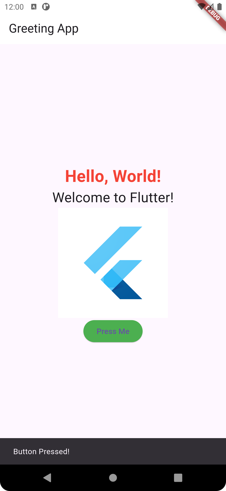

## Greeting App
A new Flutter project for Ostad assignment

# Getting Started
This Flutter application displays a simple greeting message along with an image and a button that shows a Snackbar when pressed.

# Features:
- Displays a greeting message "Hello, World!" and "Welcome to Flutter!"
- Shows an image below the text
- Includes a button that shows a Snackbar with the message "Button Pressed!" when clicked
- The button has a green background

# Screenshots

  

